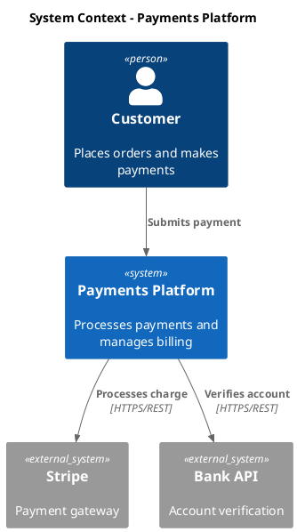
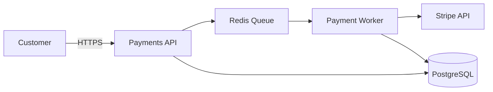

# Diagram Tooling Reference

This reference helps select and use diagram tools for architecture documentation. The framework is tool-agnostic — choose tools that fit your team. What matters is consistent usage and docs-as-code practices, not specific tools.

## Tool Comparison

### Canonical Architecture (C4 Model)

| Tool | Pros | Cons | Best For |
|------|------|------|----------|
| **C4-PlantUML** | Mature ecosystem, CI-friendly, extensive C4 support | Verbose syntax, layout control is limited | Teams already using PlantUML |
| **Structurizr DSL** | Purpose-built for C4, model-first approach, generates multiple views from one model | Requires Structurizr tooling (Lite/Cloud) | Teams wanting a single model with multiple diagram outputs |
| **Mermaid C4 extension** | Renders in GitHub/GitLab markdown natively, low friction | Limited C4 support, fewer styling options | Teams prioritizing zero-tooling rendering |
| **Ilograph** | Interactive, explorable diagrams | Commercial tool, not text-only | Teams wanting interactive exploration |

### Runtime / Infrastructure / Data Flow

| Tool | Pros | Cons | Best For |
|------|------|------|----------|
| **D2** | Clean syntax, auto-layout, built-in themes, good for topology | Newer tool, smaller community | Infrastructure topology, data flows |
| **Mermaid** | Wide rendering support, familiar syntax | Limited layout control, complex diagrams get messy | Sequence diagrams, simple flowcharts |
| **PlantUML** | Sequence and deployment diagram support, mature | Verbose, requires server for rendering | Detailed sequence diagrams |
| **Diagrams (Python)** | Programmatic, uses real cloud provider icons | Requires Python, not declarative | Cloud architecture with provider-specific icons |

### Conceptual / Communication

| Tool | Pros | Cons | Best For |
|------|------|------|----------|
| **Mermaid** | Renders in markdown, no build step | Limited styling | Quick diagrams in docs and PRs |
| **Excalidraw** | Hand-drawn aesthetic, collaborative | Not text-based (JSON), harder to diff | Whiteboard-style brainstorming |
| **ASCII diagrams** | Zero dependencies, works everywhere | Limited expressiveness | Inline code comments, terminal output |

## Docs-as-Code Requirements

Regardless of tool choice, architecture diagrams should follow docs-as-code practices:

1. **Text-based source**: Diagrams defined in text files (`.puml`, `.d2`, `.mmd`, `.dsl`), not binary formats
2. **Version-controlled**: Stored in git alongside code or in a central docs repo
3. **Reviewable**: Changes visible in PR diffs (text diffs for source, rendered previews where possible)
4. **Renderable in CI**: Automated rendering to PNG/SVG on merge (optional but recommended)
5. **No manual editing of rendered output**: Always regenerate from source

## Quick Syntax Reference

### C4-PlantUML — System Context



### Structurizr DSL — Container

```dsl
workspace {
    model {
        customer = person "Customer"
        payments = softwareSystem "Payments Platform" {
            api = container "Payments API" "Handles payment requests" "Node.js"
            db = container "Payments DB" "Stores transactions" "PostgreSQL"
            worker = container "Payment Worker" "Async payment processing" "Node.js"
            queue = container "Job Queue" "Payment job queue" "Redis"
        }
        stripe = softwareSystem "Stripe" "Payment gateway"

        customer -> api "Submits payment"
        api -> queue "Enqueues job"
        worker -> queue "Dequeues job"
        worker -> stripe "Processes charge"
        api -> db "Reads/writes"
        worker -> db "Updates status"
    }
    views {
        container payments {
            include *
            autolayout lr
        }
    }
}
```

### D2 — Runtime Flow

```d2
direction: right

customer: Customer {shape: person}
lb: Load Balancer {shape: cloud}
api: Payments API
queue: Redis Queue
worker: Payment Worker
stripe: Stripe API {style.stroke-dash: 3}
db: PostgreSQL

customer -> lb: HTTPS
lb -> api: Route
api -> queue: Enqueue job
api -> db: Read/write
queue -> worker: Dequeue
worker -> stripe: Process charge
worker -> db: Update status
```

### Mermaid — Conceptual Overview



## Rendering Pipeline

For teams that want automated rendering:

**GitHub Actions example (Mermaid + PlantUML):**
- Mermaid renders natively in GitHub markdown — no action needed
- PlantUML: use a GitHub Action with the PlantUML server to render `.puml` to `.svg` on push
- D2: use the `d2` CLI in CI to render `.d2` to `.svg`

**Structurizr:**
- Use Structurizr Lite (Docker) locally or in CI to render from the DSL
- Generates multiple diagram views from a single model file

**Keep rendered outputs in a predictable location** (e.g., `docs/architecture/rendered/`) and add them to `.gitignore` if regenerated in CI, or commit them if the team prefers browsable outputs without running tools.
